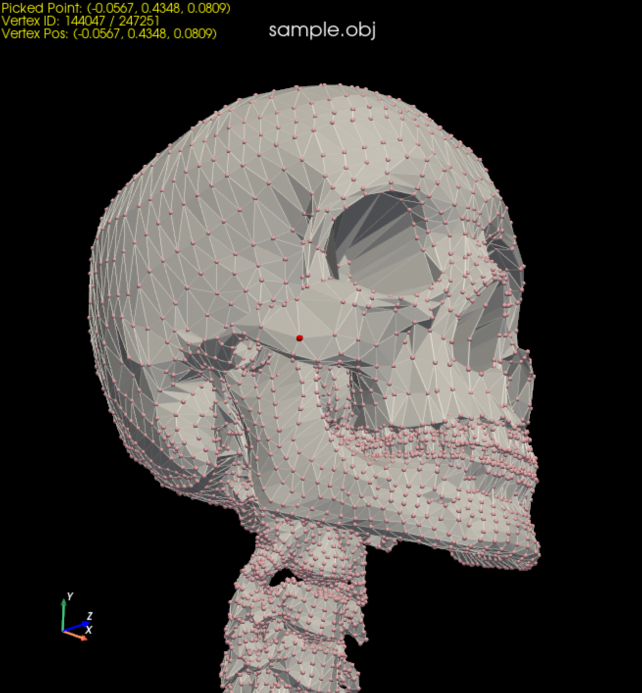

# Mesh Vertex Picker

A simple Python-based utility for 3D mesh vertex visualization and picking.  
Click any vertex to view its ID and coordinates in real time.



## Installation

1. Install [uv](https://docs.astral.sh/uv/):
```bash
# Windows
$ powershell -ExecutionPolicy ByPass -c "irm https://astral.sh/uv/install.ps1 | iex"

# macOS/Linux
$ curl -LsSf https://astral.sh/uv/install.sh | sh
```

2. Clone the repository and install dependencies:
```bash
$ git clone https://github.com/xorespesp/mesh-vertex-picker.git
$ cd mesh-vertex-picker
$ uv sync
```

## Usage

```bash
# Run with default sample (bunny.obj)
$ run.bat

# Run with custom OBJ file
$ run.bat <path/to/obj_file.obj>

# Alternative: run directly with uv
$ uv run main.py <path_to_obj_file>
```

### Controls
1. Press `p` key to enable point-selection mode.
2. Click on any red vertex to see its information.  
   (The selected vertex information appears in the upper-left corner of the window.)
